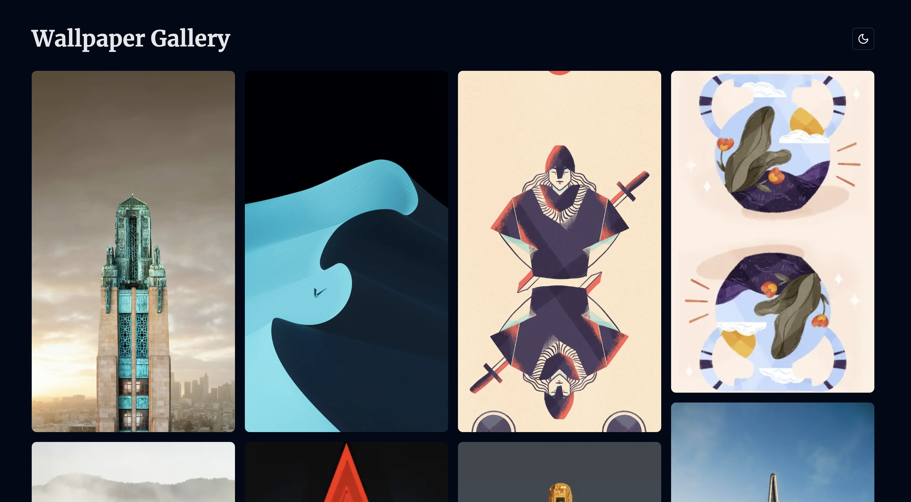
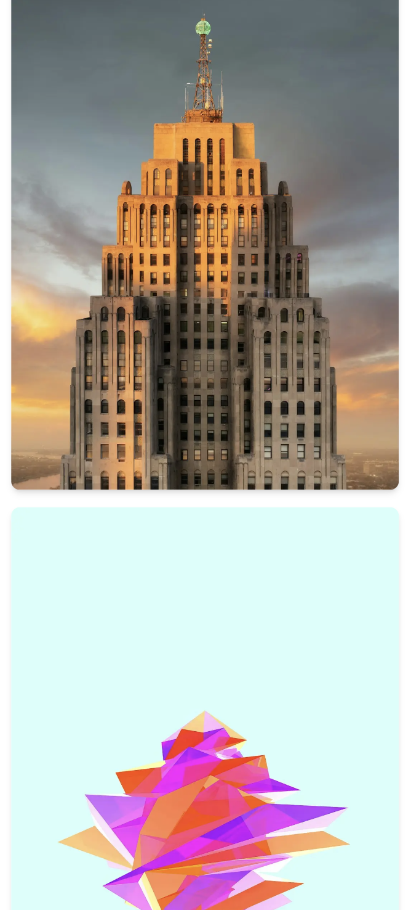
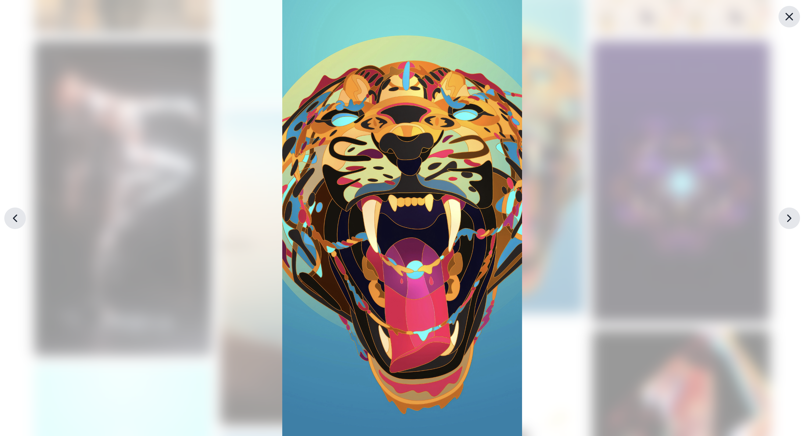

# 🖼️ Wallpaper Gallery

Welcome to the Wallpaper Gallery! This modern web application showcases high-quality wallpapers in an elegant, responsive masonry layout. With features like dark mode and full-screen viewing, it's the perfect way to browse and enjoy stunning imagery.



## ✨ Features

- 🏗️ Responsive masonry layout for optimal viewing on any device
- 🌓 Dark mode support with easy toggle
- 🔍 Full-screen image viewing with blur effect background
- ⌨️ Keyboard navigation in full-screen mode
- 🖱️ Intuitive UI with hover effects and smooth transitions
- 🚀 Optimized image loading for fast performance
- 📱 Mobile-friendly design

## 🛠️ Tech Stack

- ⚛️ [Next.js 14](https://nextjs.org/) - React framework for production
- 🎨 [Tailwind CSS](https://tailwindcss.com/) - Utility-first CSS framework
- 🎭 [ShadcnUI](https://ui.shadcn.com/) - Beautifully designed components
- 📦 [Bun](https://bun.sh/) - Fast all-in-one JavaScript runtime
- 🌙 [next-themes](https://github.com/pacocoursey/next-themes) - Perfect dark mode in Next.js
- 🧱 [react-masonry-css](https://github.com/paulcollett/react-masonry-css) - Masonry layout for React

## 🚀 Getting Started

Follow these steps to get the Wallpaper Gallery up and running on your local machine:

1. **Clone the repository**

   ```bash
   git clone https://github.com/yourusername/wallpaper-gallery.git
   cd wallpaper-gallery
   ```

2. **Install dependencies**

   Make sure you have [Bun](https://bun.sh/) installed, then run:

   ```bash
   bun install
   ```

3. **Set up environment variables**

   Create a `.env.local` file in the root directory and add any necessary environment variables.

4. **Run the development server**

   ```bash
   bun run dev
   ```

5. **Open the application**

   Navigate to [http://localhost:3000](http://localhost:3000) in your browser to see the gallery in action!

## 📸 Screenshots

Here are some screenshots showcasing the Wallpaper Gallery:

| Light Mode | Dark Mode |
|------------|-----------|
|  |  |

|  Mobile View     | Full Screen View |
|------------------|-------------|
|  |  |

## 📄 License

This project is licensed under the MIT License - see the [LICENSE](LICENSE) file for details.

Enjoy browsing through beautiful wallpapers with the gallery! 🎉